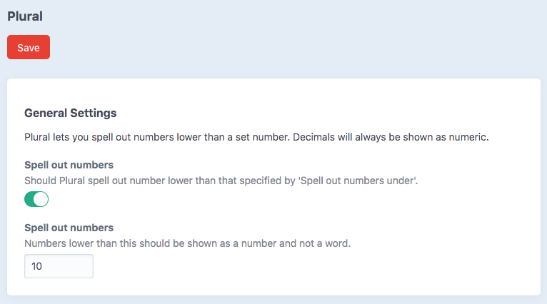

# Plural plugin for Craft CMS 3.x

Simple plural plugin for Craft



## Requirements

This plugin requires Craft CMS 3.0.0-beta.23 or later.

## Installation

To install the plugin, follow these instructions.

1. Open your terminal and go to your Craft project:

        cd /path/to/project

2. Then tell Composer to load the plugin:

        composer require WilliamIsted/plural

3. In the Control Panel, go to Settings → Plugins and click the “Install” button for Plural.

## Using Plural

Twig filter: `{{ powerPlant.lastAccident | plural( 'day' ) }} since last accident.`

Twig function: `{{ dayPlural }} since last accident.`

```jinja
{{ entries | length | plural('result') }} found.
```
Output: `2 results found.`


```jinja
{{ 0 | plural('result') }} found.
```
Output: `0 results found.`


```jinja
{{ 1 | plural('result') }} found.
```
Output: `0 result found.`


```jinja
{{ 1 | plural('result', 'foobars') }} found.
```
Output: `1 result found.`


```jinja
{{ 2 | plural('result', 'foobars') }} found.
```
Output: `2 foobars found.`

## Plural Roadmap

Some things to do, and ideas for potential features:

* If you have any simple functionality improvements to propose or issues, create a ticket here: [GitHub](https://github.com/WilliamIsted/CraftPlural/issues)

Brought to you by [William Isted](https://twitter.com/WilliamIsted)
